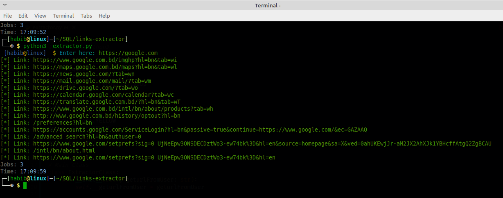

# LinkExt

### A python Script for automatically collect links from a web page. <br>

<br>

## Usage
```yaml
apt-get update
apt-get upgrade
pkg install git
pkg install python3
pip install -r requirements.txt
git clone https://github.com/thenurhabib/linkext
cd linkext
python3 run.py`
```

<br>

## Screenshot



<br>

## 🔗 Links
[](https://www.nurhabib.ml/)
[](https://twitter.com/mdnurhab1b)


## 🚀 About Me
I'm a programmer & Security Researcher.

<br>

## Author

- [@Md. Nur habib](https://www.github.com/thenurhabib)

